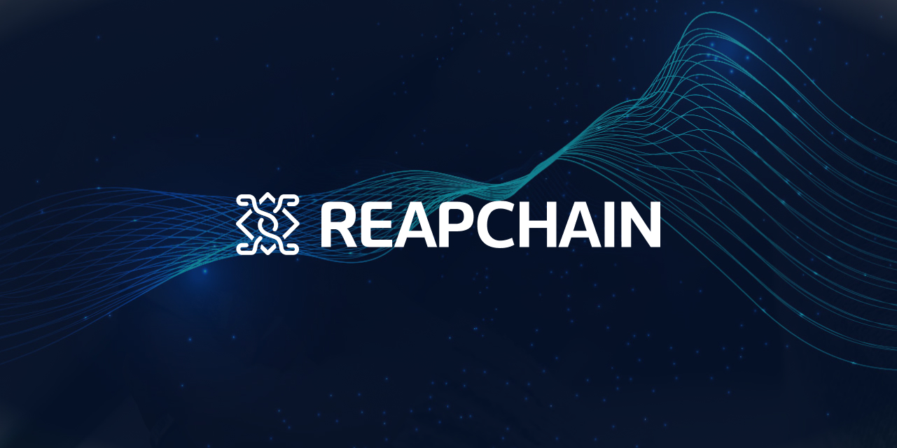

# Reapchain Core

[Reapchain Core](https://reapchain.com/file/kr/ReapChain_WhitePaper_0.9_kr.pdf) is forked from Tendermint Core [v0.34.9](https://github.com/tendermint/tendermint/tree/v0.34.9) on 2021-07-16.
And we synced up with Tendermint-[v0.34.20](https://github.com/tendermint/tendermint/tree/v0.34.20) on 2023-04-07.

For detailed analysis of the consensus protocol, including safety and liveness proofs,
see recent paper, "[The latest gossip on BFT consensus](https://arxiv.org/abs/1807.04938)".

## Releases

Please do not depend on `main` as your production branch. Use [releases](https://github.com/reapchain/reapchain-core/releases) instead.

Reapchain Core is being used in production in both private and public environments,
most notably the blockchains of the [Cosmos Network](https://cosmos.network/).
However, we are still making breaking changes to the protocol and the APIs and have not yet released v1.0.
See below for more details about [versioning](#versioning).

In any case, if you intend to run Reapchain Core in production, we're happy to help. You can
contact us [over email](mailto:helloreap@github.com).

## Minimum requirements

| Requirement | Notes            |
| ----------- |------------------|
| Go version  | Go1.18 or higher |

### Install

See the [install instructions](/docs/introduction/install.md).

### Quick Start

- [Install](./docs/introduction/install.md)
- [Quick Start](./docs/introduction/quick-start.md)

### Upgrades

In an effort to avoid accumulating technical debt prior to 1.0.0,
we do not guarantee that breaking changes (ie. bumps in the MINOR version)
will work with existing Reapchain Core blockchains. In these cases you will
have to start a new blockchain, or write something custom to get the old
data into the new chain. However, any bump in the PATCH version should be
compatible with existing blockchain histories.

For more information on upgrading, see [UPGRADING.md](./UPGRADING.md).

### Supported Versions

Because we are a small core team, we only ship patch updates, including security updates,
to the most recent minor release and the second-most recent minor release. Consequently,
we strongly recommend keeping Reapchain Core up-to-date. Upgrading instructions can be found
in [UPGRADING.md](./UPGRADING.md).

## Resources

### Tools

Benchmarking is provided by [`tm-load-test`](https://github.com/informalsystems/tm-load-test).
Additional tooling can be found in [/docs/tools](/docs/tools).

### Applications

- [Cosmos SDK](http://github.com/cosmos/cosmos-sdk); a cryptocurrency application framework
- [Ethermint](https://github.com/evmos/ethermint); Ethereum on Reapchain Core

### Research

- [The latest gossip on BFT consensus](https://arxiv.org/abs/1807.04938)
- [Original Reapchain Whitepaper](https://reapchain.com/file/kr/ReapChain_WhitePaper_0.9_kr.pdf)
